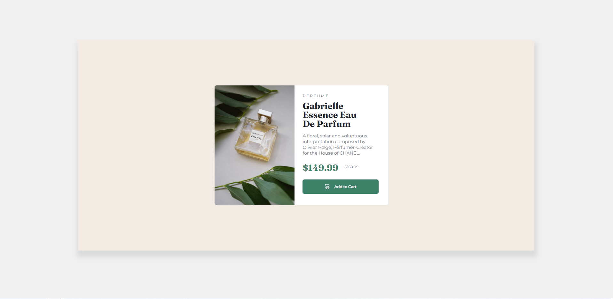

# Frontend Mentor - Product preview card component solution

This is a solution to the [Product preview card component challenge on Frontend Mentor](https://www.frontendmentor.io/challenges/product-preview-card-component-GO7UmttRfa). Frontend Mentor challenges help you improve your coding skills by building realistic projects. 

## Table of contents

  - [The challenge](#the-challenge)
  - [Screenshot](#screenshot)
  - [Links](#links)
- [My process](#my-process)
  - [Built with](#built-with)
  - [What I learned](#what-i-learned)
  - [Continued development](#continued-development)
  - [Useful resources](#useful-resources)
- [Author](#author)
- [Acknowledgments](#acknowledgments)

**Note: Delete this note and update the table of contents based on what sections you keep.**

## Overview

### The challenge

Users should be able to:

- View the optimal layout depending on their device's screen size
- See hover and focus states for interactive elements

### Screenshot




### Links

- Solution URL: [https://github.com/mchavez123/product-preview-card-component-main]
- Live Site URL: [https://mchavez123.github.io/product-preview-card-component-main/]

## My process

### Built with

- Semantic HTML5 markup
- CSS custom properties
- Flexbox
- CSS Grid

### What I learned

I learned how to center an element in the middle of a page. Also how to use percentage as a measurement instead of px. I practiced a great deal on how to incorporate styles like margin, padding, font-styles and color!

This project was so much fun to practice basic styling and positioning!

Use this section to recap over some of your major learnings while working through this project. Writing these out and providing code samples of areas you want to highlight is a great way to reinforce your own knowledge.

```html
<h1>Some HTML code I'm proud of</h1>
```
```css
.main {
  width: 75%;
  height: 75%;
  background-color: hsl(30, 38%, 92%);
  border-radius: 2px;
  box-shadow: 3px 15px 15px 6px #d9dbda;
}
```

### Continued development

This project was great practice, and I would love to keep developing my mapping out skills, of writing all the HTML first, and then styling the elements. Having a map in my mind as to how each part will work. I feel like I did good on that part but there is room for improvement!


### Useful resources

- [Example resource 1](https://www.w3schools.com) - This helped me for all the CSS styling.
- [Example resource 2](https://www.developer.mozilla.org) - Default used website for looking up elements and properties and looking at their specifications.

## Author

